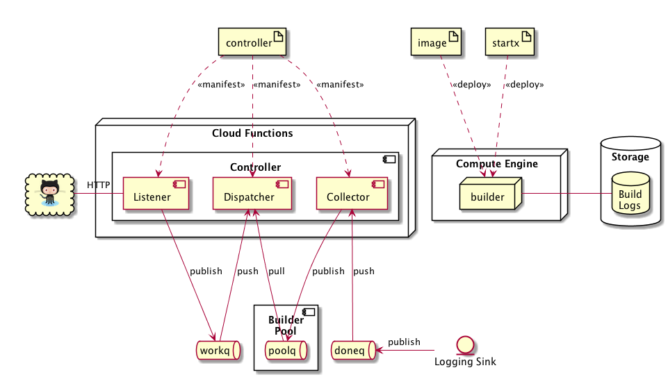
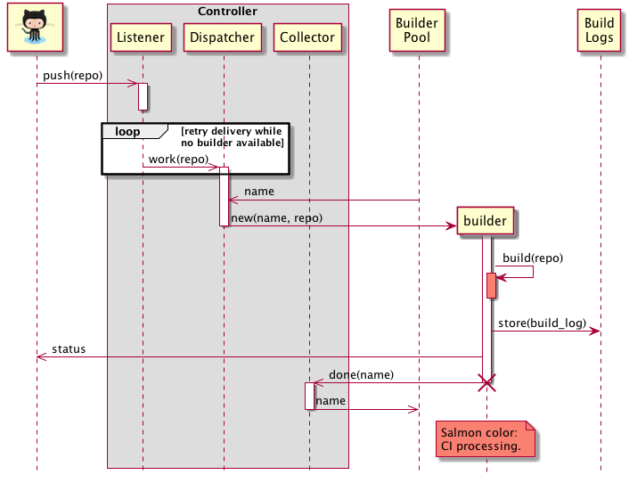

# Poor Man's CI

Poor Man's CI (PMCI - Poor Man's Continuous Integration) is a collection of scripts that taken together work as a simple CI solution that runs on Google Cloud. While there are many advanced hosted CI systems today, and many of them are free for open source projects, none of them seem to offer a solution for the BSD operating systems (FreeBSD, NetBSD, OpenBSD, etc.)

The architecture of Poor Man's CI is system agnostic. However in its first implementation provided in this repository the only supported system is FreeBSD. Support for additional systems is possible.

Poor Man's CI runs on the Google Cloud. It is possible to set it up so that the service fits within the Google Cloud ["Always Free"](https://cloud.google.com/free/docs/always-free-usage-limits) limits. In doing so the provided CI is not only hosted, but is also free! (Disclaimer: I am not affiliated with Google and do not otherwise endorse their products.)

## ARCHITECTURE

A CI solution listens for "commit" (or more usually "push") events, builds the associated repository at the appropriate place in its history and reports the results. Poor Man's CI implements this very basic CI scenario using a simple architecture, which we present in this section.

Poor Man's CI consists of the following components and their interactions:

- **`Controller`**: Controls the overall process of accepting GitHub `push` events and starting builds. The `Controller` runs in the Cloud Functions environment and is manifested by the files in the `controller` source directory. It consists of the following components:
    - **`Listener`**: Listens for GitHub `push` events and posts them as `work` messages to the `workq` PubSub.
    - **`Dispatcher`**: Receives `work` messages from the `workq` PubSub and a free instance `name` from the `Builder Pool`. It instantiates a `builder` instance named `name` in the Compute Engine environment and passes it the link of a repository to build.
    - **`Collector`**: Receives `done` messages from the `doneq` PubSub and posts the freed instance `name` back to the `Builder Pool`.
- **`PubSub Topics`**:
    - **`workq`**: Transports `work` messages that contain the link of the repository to build.
    - **`poolq`**: Implements the `Builder Pool`, which contains the `name`'s of available `builder` instances. To acquire a `builder` name, pull a message from the `poolq`. To release a `builder` name, post it back into the `poolq`.
    - **`doneq`**: Transports `done` messages (`builder` instance terminate and delete events). These message contain the `name` of freed `builder` instances.
- **`builder`**: A `builder` is a Compute Engine instance that performs a build of a repository and shuts down when the build is complete. A `builder` is instantiated from a VM `image` and a `startx` (startup-exit) script.
- **`Build Logs`**: A Storage bucket that contains the logs of builds performed by `builder` instances.
- **`Logging Sink`**: A `Logging Sink` captures `builder` instance terminate and delete events and posts them into the `doneq`.

A structural view of the system is presented below:



A behavioral view of the system follows:



## DEPLOYMENT

Prerequisites:

- Empty project in Google Cloud.

- Google Cloud SDK installed.

- `gcloud init` command has been run.

Instructions:
- Obtain a `SECRET` that will guard access to your PMCI deployment.
    ```
    $ openssl rand -hex 16
    SECRET
    ```

- Deploy PMCI to your project:
    ```
    $ ./pmci deploy SECRET
    ```

- Obtain your personal access `TOKEN` by visiting github.com > Account > Settings > Developer settings > Personal access tokens.

- On every project you want to use PMCI go to github.com > Project > Settings > Webhooks > Add Webhook.
    - URL: `https://REGION-PROJECT.cloudfunctions.net/listener?secret=SECRET&image=freebsd&token=TOKEN`
        - Update `REGION` and `PROJECT` accordingly.
    - Content-type: `application/json`
    - "Just the `push` event."

- You should now have working FreeBSD builds! Try pushing something into your GitHub project.

- To undeploy PMCI:
    ```
    $ ./pmci undeploy
    ```

**NOTE**: The default deployment uses a single builder instance of `f1-micro` with a 30GB HDD created from the FreeBSD project's `freebsd-11-1-release-amd64` image. This fits within the "Always Free" tier and is therefore free. However it is also extremely slow and can even run out of memory when compiling bigger projects (e.g. it runs out of memory 1 out of 5 times when compiling Go in June 2018). Here are some ways to improve the performance:

- Use a machine type that is faster and has more memory, such as `n1-standard-1`.

- Use a larger HDD or an SSD.

- Use a custom image that has already performed `firstboot`. The default FreeBSD image performs a system update and other expensive work when booted for the first time (i.e. the `/firstboot` file exists). An image that has already done these tests boots much faster.
    ```
    $ ./pmci freebsd_builder_create builder0
    # wait until builder has fully booted; it will do so twice;
    # when the login prompt is presented in the serial console proceed
    $ ./pmci builder_stop builder0
    $ ./pmci builder_image_create builder0 freebsd-builder
    $ ./pmci builder_delete builder0
    # now modify your controller/index.js file to point to your custom freebsd-builder image
    $ ./pmci deploy SECRET
    ```

## BUGS

- The `Builder Pool` is currently implemented as a PubSub; messages in the PubSub contain the names of available `builder` instances. Unfortunately a PubSub retains its messages for a maximum of 7 days. It is therefore possible that messages will be discarded and that your PMCI deployment will suddenly find itself out of builder instances. If this happens you can reseed the `Builder Pool` by running the commands below. However this is a serious BUG that should be fixed. For a related discussion see https://tinyurl.com/ybkycuub.
    ```
    $ ./pmci queue_post poolq builder0
    # ./pmci queue_post poolq builder1
    # ... repeat for as many builders as you want
    ```

- The `Dispatcher` is implemented as a Retry Background Cloud Function. It accepts `work` messages from the `workq` and attempts to pull a free `name` from the `poolq`. If that fails it returns an error, which instructs the infrastructure to retry. Because the infrastructure does not provide any retry controls, this currently happens immediately and the `Dispatcher` spins unproductively. This is currently mitigated by a "sleep" (`setTimeout`), but the Cloud Functions system still counts the Function as running and charges it accordingly. While this fits within the "Always Free" limits, it is something that should eventually be fixed (perhaps by the PubSub team). For a related discussion see https://tinyurl.com/yb2vbwfd.
